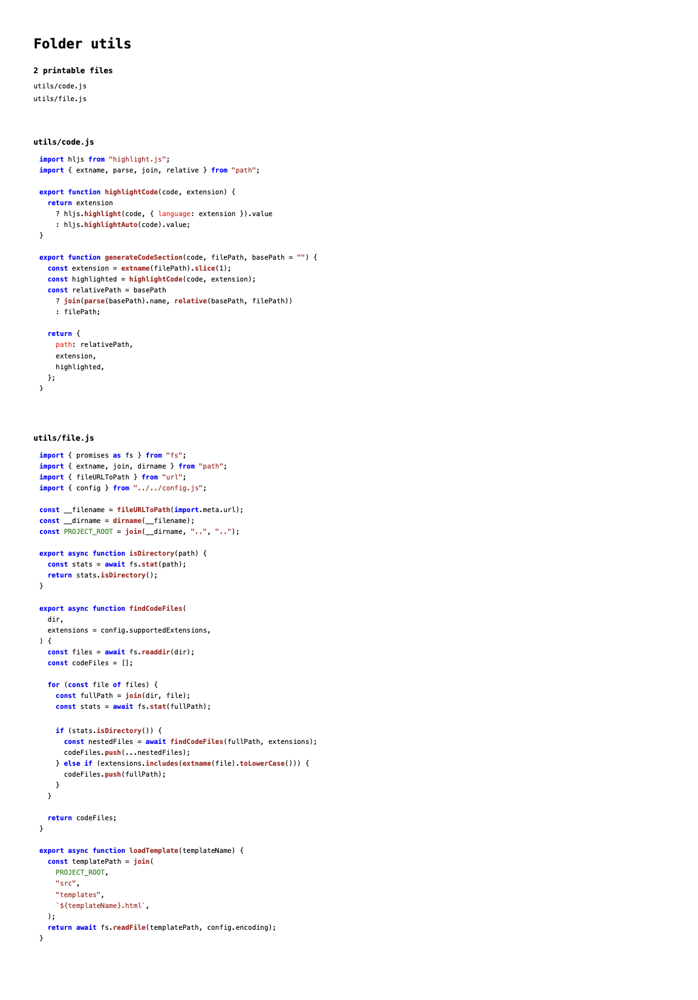

# Make Code Listing (mcl)

> [!WARNING]
> This tool was build for my personal use.

Make Code Listing (mcl) is a command-line tool built with Node.js that
transforms source code files and directories into well-formatted HTML listings.
This tool simplifies the process of creating documentation by generating
syntax-highlighted code listings with organized navigation.

Highly inspired by the
[Print VSCode extension](https://github.com/PDConSec/vsc-print).



## Features

The tool automatically generates HTML files with syntax highlighting (thanks to
[highlight.js](https://github.com/highlightjs/highlight.js)) for your source
code. When processing directories, it creates a table of contents for easy
navigation through multiple files.

## Installation

1. Clone the repository to your local machine
2. Install the required dependencies:

```bash
npm install
```

3. Make the script executable:

```bash
chmod +x ./bin/mcl
```

4. Create a global symlink:

```bash
npm link
```

To uninstall the global command:

```bash
npm unlink mcl
```

## Usage

The `mcl` command will now be available globally:

```bash
mcl <input-path>
```

You can use `mcl` in two ways:

For a single file:

```bash
mcl index.js
```

For an entire directory:

```bash
mcl ./src
```

The tool generates an HTML file named after your input with the suffix
"-code.html".

## Supported File Types

Make Code Listing provides syntax highlighting support for the following file
extensions:

- JavaScript (.js, .jsx)
- TypeScript (.ts, .tsx)
- Python (.py)
- Java (.java)
- HTML (.html)
- CSS (.css)

You can extend support for additional file types by modifying the configuration
in `config.js`.

## Project Structure

The project maintains a clear and organized structure:

```
src/
  templates/          # HTML template files
    base.html         # Main document template
    code-section.html # Code section template
    toc.html          # Navigation template
  utils/
    file.js           # File handling operations
    code.js           # Syntax highlighting logic
config.js             # Configuration settings
index.js              # Application entry point
```

## Customization

You can modify the HTML templates located in the `src/templates` directory to
adjust the output format and styling. The templates use a straightforward
{{PARAMETER}} syntax for dynamic content insertion.

## License

This project is licensed under the MIT License.
